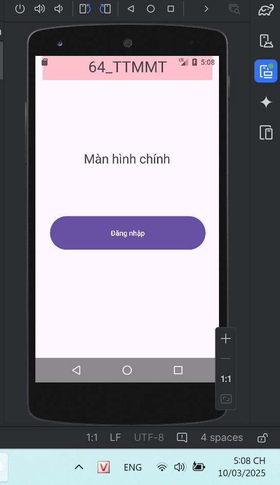
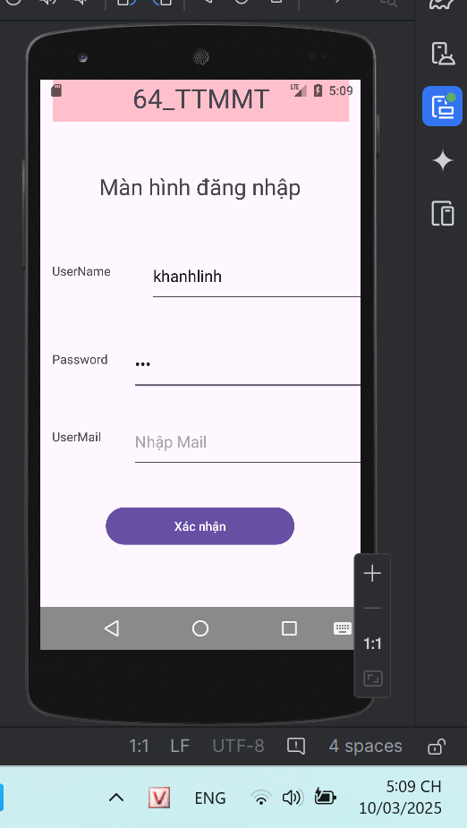

# 64131172_AndroidProgramming
Lưu các bài thực hành!

## 🎯 Giới thiệu  
Chào bạn, mình là **Khánh Linh**  

---

## 📌 LT_GK  
| Hình ảnh | Mô tả |
|----------|-------|
|| Giao diện câu2|
|| Giao diện câu1|
|| Giao diện 1|

---

## 📌 LT_Figma  
| Hình ảnh | Mô tả |
|----------|-------|
|| Giao diện MathSetting|
|| Giao diện HomeMath1 - thêm nút Home|
|| Giao diện HomeMath1|
|| Giao diện Home Page|
|| Giao diện Landing Page|

---

## 📌 LT_DiemCong  
| Hình ảnh | Mô tả |
|----------|-------|
|| Giao diện|
|| Giao diện|

---

## 📌 TH_LoginPage  
| Hình ảnh | Mô tả |
|----------|-------|
|| Giao diện|

---

## 📌 VD_BtnNut  
| Hình ảnh | Mô tả |
|----------|-------|
|| Giao diện|

---

## 📌 Bài làm thêm: Danh sách Abum Tear Your Self  
| Hình ảnh | Mô tả |
|----------|-------|
|| Giao diện Đăng nhập |
|| Giao diện Danh sách bài hát |

---
## 📌 Ex_ListView: Danh sách Ngôn ngữ lập trình  
| Hình ảnh | Mô tả |
|----------|-------|
|| Giao diện Danh sách NNLT |

---

## 📌 Bài làm thêm: Tính diện tích hình Chữ nhật  
![Giao diện ứng dụng]  

---

## 💻 Giao diện máy tính  
| Hình ảnh | Mô tả |
|----------|-------|
|  | Giao diện máy tính |

---

## Tính tổng 2 số!  
| Hình ảnh | Ghi chú |
|----------|---------|
|  | Hoàn thành |

---

## 🔄 Chuyển màn hình (Logic Navigation)  
| Hình ảnh | Ghi chú |
|----------|---------|
|  | Màn hình 1 |
|  | Màn hình 2 |
|  | Màn hình 3 |
